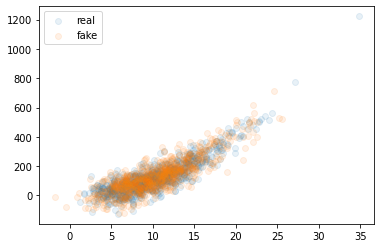
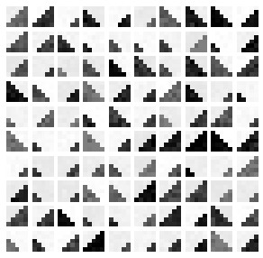
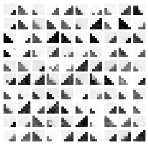
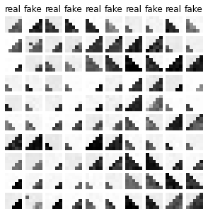

# flow

This project implements basic Normalizing Flows in PyTorch 
and provides functionality for defining your own easily, 
following the conditioner-transformer architecture.

This is specially useful for lower-dimensional flows and for learning purposes.
Nevertheless, work is being done on extending its functionalities 
to also accomodate for higher dimensional flows.

Supports conditioning flows, meaning, learning probability distributions
conditioned by a given conditioning tensor. Specially useful for modelling causal mechanisms.


# Getting started

## Installation

```
pip install flow-torch
```

## Dependencies

This project tries to be as lightweight as possible. 
Apart from [PyTorch](https://pytorch.org/) and [NumPy](https://pytorch.org/), 
which are essential for the project, only [Matplotlib](https://matplotlib.org/) 
and [tqdm](https://github.com/tqdm/tqdm) are also required for training visualization purposes.

Each specific dependency is listed in requirements.txt


## 2-dimensional example

This example is executed in this [notebook](examples/README-example.ipynb) with a synthetic dataset.

```python
from flow.flow import Sequential
from flow.conditioner import MADE
from flow.transformer import DSF
from flow.modules import BatchNorm
from flow.training import get_device, train, plot_losses, test_nll

import matplotlib.pyplot as plt # used for plotting flow samples later

trainX, valX, testX = ... # torch.Tensors (n_samples, dim) with the data
dim = trainX.size(1) # dimension of the flow

device = get_device() # cuda if available, cpu otherwise

# X transformed to base distribution U, like so:
# X -> BatchNorm -> MADE-DSF -> BatchNorm -> MADE-DSF -> U
flow = Sequential(
    BatchNorm(dim=dim), # we use BatchNorm for training stabilization
    MADE(DSF(dim=dim)), # combines a MADE conditioner with an Affine transformer
    
    BatchNorm(dim=dim),
    MADE(DSF(dim=dim))
).to(device) # don't forget to send it to device

# Train the flow with the train function, but you can use your own.
# train uses early stopping, that's why we need a validation set.
train_losses, val_losses = train(flow, trainX, valX)

# Plot training and validation losses
plot_losses(train_losses, val_losses)

# Compute the test set negative log-likelihood (the loss function used for training)
print(test_nll(flow, testX))

# Generate some samples from the learned distribution
with torch.no_grad():
    sample = flow.sample(1000)
    sample = sample.cpu().numpy() # to numpy array
    
# Assuming dim=2, we can plot them with a scatterplot
plt.scatter(*trainX.numpy().T, alpha=.1, label='real')
plt.scatter(*sample.T, alpha=.1, label='fake')
plt.legend();
```

For the 2D synthetic dataset we create here, these are the results:




## Image example

This [example](examples/Stairs.ipynb) tries to learn the distribution of some 5x5 grayscale synthetic images with pictures of stairs of varying orientations and sizes (left figure). We train an unconditional flow and plot samples from it (center figure), and also a conditional flow (conditional on image labels: orientation and size) and plot samples from it using the labels from the test dataset (right figure).

Real samples|Fake samples (unconditional)|Fake samples (conditional)
:-------------------------:|:-------------------------:|:-----------:
||  

## Documentation

Documentation can be found [here](https://aparafita.github.io/flow)

* Examples: notebook examples in the [examples](examples/) folder.
* Tutorials: notebook tutorials in [tutorials](tutorials/) folder.


# Contributing

If you want to contribute, please read [CONTRIBUTING.md](CONTRIBUTING.md) for some guidelines.


# License

This project is licensed under the MIT License - see the [LICENSE](LICENSE) file for details.
